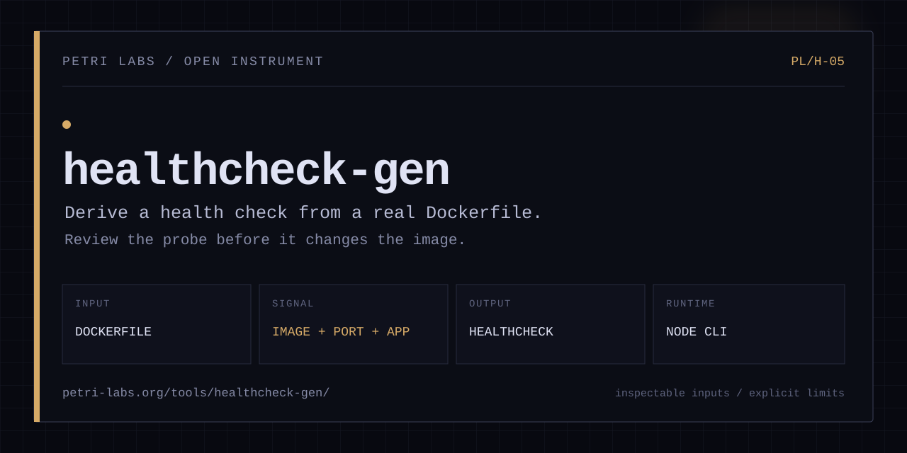

<p align="center">
  
</p>

<p align="center">
  <a href="https://www.npmjs.com/package/@barissozudogru/healthcheck-gen"></a>
  <a href="https://www.npmjs.com/package/@barissozudogru/healthcheck-gen"></a>
  <a href="https://github.com/barissozudogru/healthcheck-gen/actions/workflows/ci.yml"></a>
  <a href="./LICENSE"></a>
</p>

# healthcheck-gen

Generate Docker HEALTHCHECK instructions by analyzing your Dockerfile.

`healthcheck-gen` reads your Dockerfile to detect the base image, framework, and exposed port. It generates a `HEALTHCHECK` instruction ready to paste into your `Dockerfile` or `docker-compose.yml`, and surfaces a minimal `/health` endpoint snippet for the detected framework. It chooses `wget` on Alpine, a built-in runtime probe for supported slim images, and `curl` on fuller images. It safely replaces existing `HEALTHCHECK` instructions in multi-stage builds and outputs plain Dockerfile syntax, Compose YAML, or JSON.

[Tool page](https://petri-labs.org/tools/healthcheck-gen/) · [npm](https://www.npmjs.com/package/@barissozudogru/healthcheck-gen) · [Source](https://github.com/barissozudogru/healthcheck-gen)

```bash
# Install globally
npm install -g @barissozudogru/healthcheck-gen

# Or run directly with npx
npx @barissozudogru/healthcheck-gen
```

## Supported Base Images

| Base image | Health check strategy | Default port |
|---|---|---|
| `node` | Node `fetch` on slim images, otherwise `curl` or `wget` to `/health` | from `EXPOSE` or `3000` |
| `python` | Python `urllib` on slim images, otherwise `curl` or `wget` to `/health` | from `EXPOSE` or `3000` |
| `golang` / `golang:*-alpine` | `curl -f` or `wget` to `/health` | from `EXPOSE` or `3000` |
| `postgres` / `postgres:*-alpine` | `pg_isready -U ${POSTGRES_USER:-postgres}` | `5432` |
| `redis` / `redis:*-alpine` | `redis-cli ping` | `6379` |
| `nginx` / `nginx:*-alpine` | `curl -f` or `wget` to `/` | `80` |

Alpine variants are detected by inspecting the image tag for the string `alpine`. When found, `wget -q --spider` replaces `curl -f` since curl is not always present in Alpine-based images.

Framework detection covers: Express, Fastify, Next.js, NestJS, FastAPI, Flask, Django, Gin, Fiber, and Echo. Each gets a matching `/health` endpoint snippet in the output.

## Usage

```
healthcheck-gen [options]
```

Run without arguments to analyze `./Dockerfile` in the current directory.

## Options

| Flag | Argument | Default | Description |
|---|---|---|---|
| `--dockerfile` | `<path>` | `./Dockerfile` | Path to the Dockerfile to analyze |
| `--append` | - | - | Append the generated `HEALTHCHECK` to the Dockerfile (replaces any existing one) |
| `--compose` | - | - | Print the equivalent `docker-compose.yml` healthcheck block |
| `--json` | - | - | Output all results as JSON (useful for scripting and CI) |
| `--none` | - | - | Generate `HEALTHCHECK NONE` to explicitly disable health checking |
| `--interval` | `<duration>` | `30s` | Override the `--interval` timing parameter |
| `--timeout` | `<duration>` | `5s` | Override the `--timeout` timing parameter |
| `--retries` | `<n>` | `3` | Override the `--retries` count |
| `--start-period` | `<duration>` | `10s` | Override the `--start-period` timing parameter |
| `--help`, `-h` | - | - | Show help message |
| `--version`, `-v` | - | - | Print version |

Duration values accept the same format Docker does: `30s`, `1m30s`, `2m`, etc.

## Example Output

Given a `Dockerfile` that starts with `FROM node:20-alpine` and `EXPOSE 3000`:

```
healthcheck-gen analysis for /app/Dockerfile
------------------------------------------------------------

Detected
  Base image  : node:20-alpine
  App type    : node
  Framework   : express
  Port        : 3000

HEALTHCHECK instruction
HEALTHCHECK \
  --interval=30s \
  --timeout=5s \
  --start-period=10s \
  --retries=3 \
  CMD wget -q --spider http://localhost:3000/health || exit 1
```

Running with `--compose` adds:

```yaml
services:
  your-service:
    healthcheck:
      test: ["CMD-SHELL", "wget -q --spider http://localhost:3000/health || exit 1"]
      interval: 30s
      timeout: 5s
      start_period: 10s
      retries: 3
```

Running with `--compose` also prints a suggested `/health` endpoint snippet:

```js
// Express health endpoint
app.get('/health', (req, res) => {
  res.status(200).json({ status: 'ok', timestamp: new Date().toISOString() });
});
```

### Verified excerpt from a real Dockerfile

Running the current release against the public `release-intel-mcp` Dockerfile detects its actual runtime and produces a probe that does not assume `curl` is installed. The final line below is shortened for readability:

```text
Detected
  Base image  : node:22-slim
  Framework   : express
  Port        : 3000

HEALTHCHECK CMD node -e "fetch('http://localhost:3000/health')..."
```

If this saves you time, consider [starring the repository](https://github.com/barissozudogru/healthcheck-gen). It helps other developers find it.

## More Usage Examples

Analyze a specific Dockerfile:

```bash
healthcheck-gen --dockerfile ./docker/Dockerfile.prod
```

Append the generated instruction directly to the Dockerfile:

```bash
healthcheck-gen --append
```

Print the Compose block alongside the instruction:

```bash
healthcheck-gen --compose
```

Append and print the Compose block together:

```bash
healthcheck-gen --append --compose
```

Output as JSON for use in scripts or CI pipelines:

```bash
healthcheck-gen --json
```

Disable health checking entirely:

```bash
healthcheck-gen --none --append
```

Override all timing parameters:

```bash
healthcheck-gen --interval 60s --timeout 10s --retries 5 --start-period 30s
```

## CI Integration

Use the reusable action to generate a reviewable workflow summary without changing the Dockerfile:

```yaml
name: Health check review

on: [pull_request]

jobs:
  healthcheck:
    runs-on: ubuntu-latest
    permissions:
      contents: read
    steps:
      - uses: actions/checkout@v4
      - uses: barissozudogru/healthcheck-gen@v0.5.1
        with:
          dockerfile: Dockerfile
```

Set `append: true` only when the workflow should modify the checked-out Dockerfile. The action leaves committing or opening a pull request to the surrounding workflow so the diff remains explicit.

Use `--json` to consume the output in a pipeline step:

```yaml
- name: Generate HEALTHCHECK
  run: |
    npx @barissozudogru/healthcheck-gen --json > healthcheck.json
    cat healthcheck.json | jq '.dockerfileInstruction'
```

Or append directly during a Docker build preparation step:

```yaml
- name: Append HEALTHCHECK to Dockerfile
  run: npx @barissozudogru/healthcheck-gen --append
```

## Exit Codes

| Code | Meaning |
|---|---|
| `0` | Success |
| `1` | Dockerfile not found, parse error, or invalid arguments |

## License

[MIT](./LICENSE)
